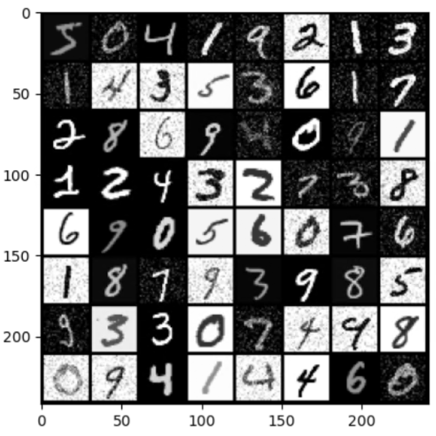

# Dataset Info

The MNIST database of handwritten digits is a subset of a larger set available from NIST. The digits have been size-normalized and centered in a fixed-size image.
It is a good database for people who want to try learning techniques and pattern recognition methods on real-world data while spending minimal efforts on preprocessing and formatting.
| Items | Info | 
|-------|--------|
| Name  | [THE MNIST DATABASE of handwritten digits](http://yann.lecun.com/exdb/mnist/)|
|Training Set | 60,000 |
|Test Set | 10,000 |
| Image Size | 28 x 28 | 
| class num | 10 | 

Load and and augmennt by nosie: 

