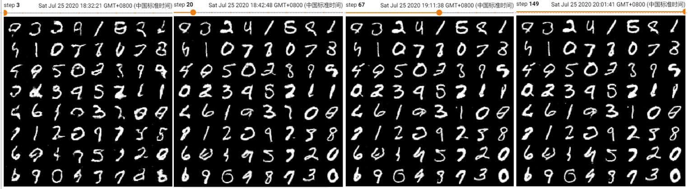
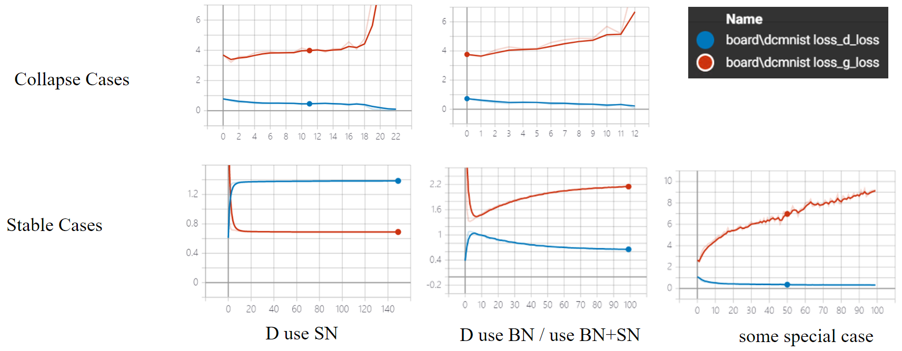

# Generative Adversarial Nets

Pioneering work in GAN:

| Arch Name | Accepted (cite) | Details |
|-| -|-|
| GAN       | NIPS2014 (20895) | vanilla version; unstable & fully connected|
| c-GAN     | arXiv2014 (2938) | Conditional sampling; full connection |
| **DCGAN** | arXiv2015 (5807) | first fully conv | 
| WGAN-GP   | NIPS2017 (2601) | Wasserstein Loss; The improvement of fully connected structure and wgan |
| LSGAN     | Procced2017 (1187) | Loss MSE, fully conv |
| **InfoGAN**   | NIPS2017 (2006) | Interpretable & Disentangled rep., fully conv|
| BEGAN     | arXiv2017 ( 649) |add AE arch fully conv |

## 01. DC-GAN for MNIST

This is the first GAN using transposed convolution as **G** and convolution as **D**. 

In /arch, we deployed a mini dcgan to map the a **N(0, 1)^16** or **U(-1, 1)^16** distribution to **MNIST(min0, max1)^(28, 28)**.

|Item | #Layers | #Paras | Learning rate |
|-|-|-|-|
| G   | 4 | 172, 608 | 2e-4| 
| D   | 4 | 142, 208(BN,BN+SN) or 141,824(SN) | 5e-4| 

For D:
- Higher learning rate, avoid Collapse; 
- Spectral Norma in D: outside the conv of D, avoid Collapse; 
- Batch Norm in D: get darker background and lighter foreground; 

For G: 
- Lower learning rate, avoid Collapse; 
- Batch Norm in G: if missing, the background will be gray. 

For Tatal Train: 
- One-sided label smoothing: set real score less than 1.0, avoid Collapse; 
- Initialization: xavier, norm, kaming have few differences. 
- Noise can be **N(0, 1)^16** or **U(-1, 1)^16**, cannot be **U(0, 1)^16**. 

Unfortunately, GANs' losses are very non-intuitive. Mostly it happens down to the fact that generator and discriminator are competing against each other, hence improvement on the one means the higher loss on the other, until this other learns better on the received loss, which screws up its competitor, etc.

Now one thing that should happen often enough is that both D and G losses are converging to some permanent numbers:

This loss convergence would normally signify that the GAN model found some optimum, where it can't improve more, which also should mean that it has learned well enough. (Also note, that the numbers themselves usually aren't very informative.)

Here are a few side notes:
- Unconverged loss doesn't necessarily mean the model hasn't learned anything - check the generated examples, sometimes they come out good enough; 
- Well-converged loss may also get terrible results - sometimes the generator finds one/few examples that discriminator can't distinguish from the genuine data. The trouble is it always gives out these few, not creating anything new, this is called mode **collapse**. Usually introducing some diversity to your data helps.
(From [stackoverflow](https://stackoverflow.com/questions/42690721/how-to-interpret-the-discriminators-loss-and-the-generators-loss-in-generative))

## 02. InfoGAN for MNIST
InfoGAN is a type of generative adversarial network that modifies the GAN objective to encourage it to learn interpretable and meaningful representations. This is done by maximizing the mutual information between a fixed small subset of the GAN’s noise variables and the observations.
