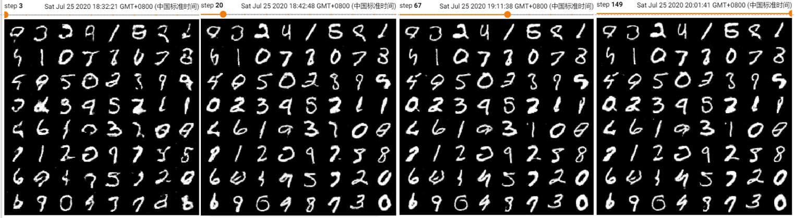

# Generative Adversarial Nets

Pioneering work in GAN:

| Arch Name | Accepted (cite) | Details |
|-| -|-|
| GAN       | NIPS2014 (20895) | very begin; unstable & fully connected|
| c-GAN     | arXiv2014 (2938) | Conditional sampling; full connection |
| **DCGAN** | arXiv2015 (5807) | first fully conv | 
| WGAN-GP   | NIPS2017 (2601) | Wasserstein Loss; The improvement of fully connected structure and wgan |
| LSGAN     | Procced2017 (1187) | Loss MSE, fully conv |
| **InfoGAN**   | NIPS2017 (2006) | Interpretable, fully conv|
| BEGAN     | arXiv2017 ( 649) |add AE arch fully conv |

## 01. DC-GAN for MNIST
This is the first GAN using transposed convolution as **G** and convolution as **D**. 

In /arch, we deployed a mini dcgan to map the a **N(0, 1)^16** or **U(-1, 1)^16** distribution to **MNIST(min0, max1)^(28, 28)**.

|Item | #Layers | #Paras | Learning rate |
|-|-|-|-|
| G   | 4 | 172, 608 | 2e-4| 
| D   | 4 | 142, 208 | 5e-4| 

Tricks to avoid Collapse. 

For D:
- Higher learning rate for D; 
- Spectral Norma in D: outside the conv of D;

For G: 
- Lower learning rate for D; 
- Batch Norm in G: important. 缺少后结果整体发灰;

For Tatal Train: 
- One-sided label smoothing: set real score less than 1.0 (e.g 0.9); 
- Initialization: xavier, norm, kaming have few differences. 
- Noise can be **N(0, 1)^16** or **U(-1, 1)^16**, cannot be **U(0, 1)^16**. 

