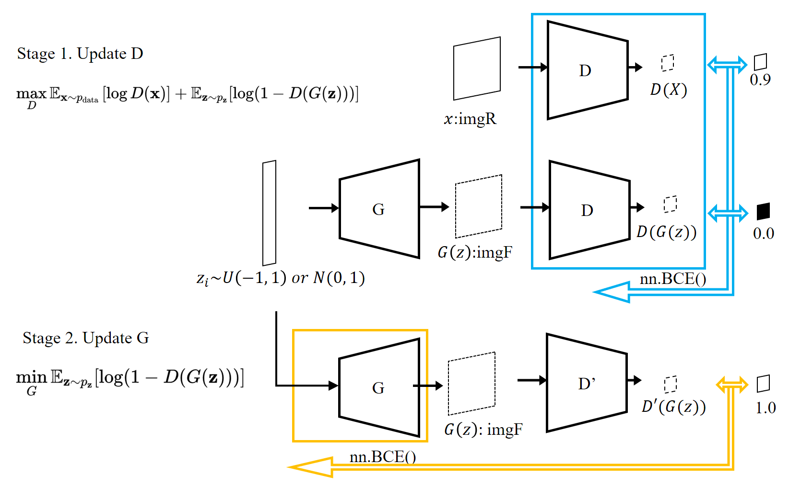
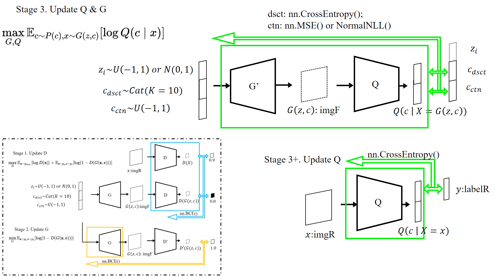
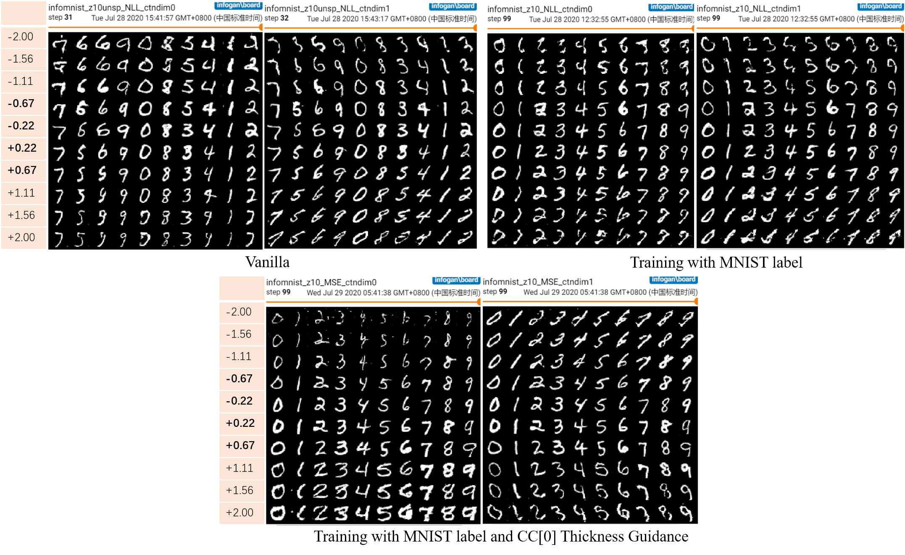

# Generative Adversarial Nets

Pioneering work in GAN:
| Arch  | Accepted (cite) | Details |
|-| -|-|
| GAN       | NIPS2014 (20895) | vanilla version; unstable & fully connected|
| c-GAN     | arXiv2014 (2938) | Conditional sampling; full connection |
| **DCGAN** | arXiv2015 (5807) | first fully conv | 
| LSGAN     | Procced2017 (1187) | Loss MSE, fully conv |
| **InfoGAN**   | NIPS2017 (2006) | Interpretable & Disentangled rep., fully conv|
| **WGAN-GP** | NIPS2017 (2601) | Wasserstein Loss + Gradient Penalty |
| BEGAN     | arXiv2017 ( 649) |add AE arch fully conv |

Existing deployment progress (table of contents): 
* [DCGAN](#01.-DCGAN-on-MNIST)
* [WGAN-GP](#02.-WGAN-GP-on-MNIST)
* [InfoGAN](#03.-InfoGAN-on-MNIST)

## 01. DCGAN on MNIST
> Q: How to make GAN more stable? 
 A: FC to Conv. 
### Background
DCGAN is the first GAN using transposed convolution as **G** and convolution as **D**. 

### Deployment
A tiny DCGAN were deployed in /arch/dcgan_minist.py to map the a **N(0, 1)**16 or **U(-1, 1)**16 distribution to **MNIST(**min=0, max=1**)**(28,28).

|Item | #Layers | #Paras | Learning rate |
|-|-|-|-|
| G   | 4 | 172, 608 | 2e-4| 
| D   | 4 | 142, 208(BN,BN+SN) or 141,824(SN) | 5e-4| 

### Tricks
For D:
- Higher learning rate, avoid Collapse; 
- Spectral Norma in D: outside the conv of D, avoid Collapse; 
- Batch Norm in D: get darker background and lighter foreground; 

For G: 
- Lower learning rate, avoid Collapse; 
- Batch Norm in G: if missing, the background will be gray. 

For Total Train: 
- One-sided label smoothing: set real score less than 1.0, avoid Collapse; 
- Initialization: xavier, norm, kaming have few differences. 
- Noise can be **N(0, 1)^16** or **U(-1, 1)^16**, cannot be **U(0, 1)^16**. 

### Take Home
GANs' losses are non-intuitive. One thing that should happen often enough is that both D and G losses are converging to some permanent numbers: This loss convergence would normally signify that the GAN model found some optimum, where it can't improve more, which also should mean that it has learned well enough. (Also note, that the numbers themselves usually aren't very informative.)

Here are a few side notes:
- Non convergent loss doesn't necessarily mean the model hasn't learned anything - check the generated examples, sometimes they come out good enough; 
- Well-converged loss may also get terrible results - sometimes the generator finds one/few examples that discriminator can't distinguish from the genuine data. The trouble is it always gives out these few, not creating anything new, this is called mode **collapse**. 
(From [stackoverflow](https://stackoverflow.com/questions/42690721/how-to-interpret-the-discriminators-loss-and-the-generators-loss-in-generative))

### Limitations
- DCGAN increases the stability from the random dist *p(Z)* to the image dist *p(X)*, but the the relation btw 
*dz* and *dx* is still unclear, i.e., the invariance before and after mapping is not considered;
- DCGAN improves the instability of the original GAN from the structural point of view, but later studies show that criterions have a greater influence (WGAN-GP). 

## 02. WGAN-GP on MNIST
> Q: How to make GAN more stable? 
 A: Use better criterion. 

### Background
### Deployment
### Take Home
### Limitations

## 03. InfoGAN on MNIST
> Q: How to give each dimension meaning without supervision? 
 A: Function is defined by structure. 

### Background
Based on the DCGAN, InfoGAN modifies the GAN's objective to encourage it to learn interpretable and meaningful representations. This is done by maximizing the *mutual information* between a fixed small subset of the GAN’s noise variables and the observations.

Here the latent code was divided into 3 parts : implicit or incompressible meaning (dim = X), discrete meaning (dim = categories), continuous meaning (dim = principal components needed). 

When training, G and D were carried out in exactly the same training mode as ordinary GAN. 

By adding a classifier for discrete meaning learning ("drastic change in shape") and a regressor for continuous meaning learning ("continuous variations in style") in the last layer of D, the **mutual information** is used to guide G to learn the clear categories information and the style (e.g. rotation, thickness, etc.) within the category. The part may be regarded as **Q** in some deployments.

### Deployment
A tiny InfoGAN were deployed in /arch/dcgan_minist.py to map the a **z~U(-1, 1)**10,**dc~Cat(10)**10,**cc~U(-1, 1)**2 joint distribution to **MNIST(**min=0, max=1**)**(28,28).

|Item | #Layers | #Paras | Learning rate |
|-|-|-|-|
| G   | 4 | 184, 896 | 2e-4| 
| DwQ   | 3 | 170, 894 (4head:NormNLL) or 166,796 (3 head:MSE) | 5e-4 for D, 1e-4 for Q-G| 

### Take Home
Stability of Training Process:
- The use of ` nn.MSELoss `or `NormNLL` to Q's continuous learning has few difference in generative results.

- The relative value of the 3 learning rates of G, D, G&D  has a great influence on the final results and stability. More experiments are needed for quantitative research. 

Quality of generated results: 

- By adding real label with real image  of MNIST into the training process of Q, one-hot categories definition would be exactly consistent with the **N+** 0, 1, ..., 9, as shown in the 2nd group of experiments.  
Otherwise, the final discrete code may capture an arbitrary K = 10 cluster result,which may keep more than one handwritten digits in a single category.
Despite all this, as demonstrated in paper, unsupervised training also achieved 5% error to classify MNIST after class-matching. 

- By adding Thickness Guidance in one of the Continuous dim (no harm in CC[0])into the training process of Q, the value of CC [0] is related to random sampling and the thickness of figure in corresponding fake image, while the value of CC [1] only comes from random sampling of **U(- 1,1)**. In this way, CC [0] and CC [1] will be more **disentangled**. As shown in the 3rd group of experiments, CC [0] implies a more thickness dependent and linear relationship. 

### Limitations
Original InfoGAN contributes to the interpretability of Z, that is, the relationship between *dz* and *dx*. 
However, its interpretable part coding has obvious dis. 

In code of category, it uses one-hot code. Although it is easy to learn, it occupied too many bytes. 

In code of continuous:
1) the independence between the dimensions of the learned CC cannot be guaranteed. Adjusting CC [0] may not only change the tilt angle, but also change the thickness. 
2) For different categories, the same CC [i] may make 1 thicker, but 9 thinner. 

The above problems show that although InfoGAB has established the mapping between **dx** and **dz**, the independence and linearity of each dimension are not guaranteed (PCA have both, but cannot generate new instances). 
